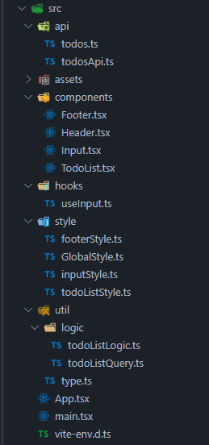

# TypeScript를 사용하여 TodoList 만들기

## 기능 설명

TanStack Query를 활용하여 json-server를 통한 비동기 통신 상태관리를 하였습니다.

처음으로 작성하는 타입스크립트가 생각보다 많이 헷갈렸지만 그래도 생각보다 그렇게 많이 어렵다는 생각이 들지는 않았던 거 같습니다.
(아직 어려운걸 안 해봐서 그런걸 수도 있는거 같습니다.)

그렇게 Query를 적용하면서 타입정의를 생각보다 꼼꼼히 해야 한다는 것을 알게 되는 계기였던 거 같습니다.

타입스크립트로 Query를 작성할 경우 받을 값의 타입을 지정해야되고 안에 querykey나 queryfn같은 것을 설정해야 사용할 수 있다는 것을 알게되었습니다.
mutation의 경우에도 타입을 지정해주어야 하고 뮤테이션의 경우 받을 값외에 넣는 인자가 있을 경우 그 인자의 타입도 지정해야 되는 것에서 좀 많이 해맸던거 같습니다.

그렇게 해서 todoListQuery.ts 파일 안에 하나로 모아놨습니다.

## 파일 구조

### 파일구조 사진

위의 사진처럼 구성하여 파일을 나누었고 util폴더안에 logic이라는 폴더를 만들어서 query문은 따로 빼서 작성을 해 놓았습니다.
